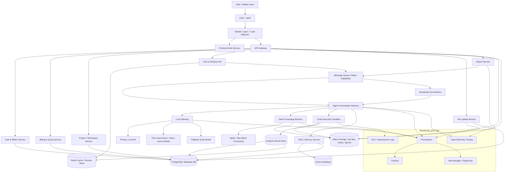

# Q2(2): InsightPilot AI 工业级系统架构设计

## 1. LLM 使用声明

在本部分报告中，我使用 **OpenAI ChatGPT / Codex based on GPT-5** 辅助完成 InsightPilot AI 的工业级系统架构设计，包括需求拆解、模块设计、高并发方案、LLM engine 设计、数据库设计、监控运维方案和系统架构图。最终架构、技术选型和容量估算由我检查与调整，我对报告内容负责。

本设计参考了 AI-System-Design、System-Design-Primer 和 System-Design-101 中关于 AI system、load balancing、horizontal scaling、caching、message queue、database replication/sharding、observability 和 fault tolerance 的设计原则。

## 2. 设计目标与业务背景

InsightPilot AI 是一个面向中小企业的 AI data analysis agent。用户可以上传 CSV/Excel，或连接 Google Sheets、Shopify、Google Ads、PostgreSQL 等数据源，然后用自然语言提出数据分析问题。系统需要自动完成数据理解、清洗、代码生成、沙箱执行、图表生成、报告导出和业务解释。

本架构目标是支持 industrial-grade deployment，并具备 **100,000-level concurrency** 的扩展能力。这里的 100,000 级并发指平台可同时支撑约 100,000 在线用户，其中一部分用户正在浏览项目、查看报告、下载图表，另一部分用户正在发起 LLM analysis、执行代码或生成报告。由于 LLM 推理和数据分析任务成本高，系统采用同步 + 异步混合架构：轻量请求走在线 API，重型分析任务进入 queue，由 worker pool 异步处理。

## 3. 核心需求

### 3.1 Functional Requirements

1. 用户注册、登录、组织和 workspace 管理。
2. 上传 CSV/Excel 文件，或连接外部 business data sources。
3. 自动进行 data profiling，包括 schema detection、missing values、outliers、date parsing 和 basic statistics。
4. 用户用自然语言提出分析问题。
5. LLM engine 将问题拆解为 analysis plan、Python/SQL code 和 explanation。
6. Code execution sandbox 执行数据分析代码，生成 tables、charts 和 logs。
7. 系统将结果整理成自然语言 answer、charts、dashboard blocks 和 PDF/PPT report。
8. 保存 analysis history，支持复现、分享和团队协作。
9. 支持 scheduled reports，例如每周自动生成销售分析报告。
10. 提供 admin panel、billing、quota management 和 audit logs。

### 3.2 Non-Functional Requirements

| 指标 | 目标 |
|---|---|
| Concurrency | 支持 100,000 在线用户 |
| Availability | 核心服务 99.9%+ 可用性 |
| Latency | 普通页面/API p95 < 300ms；轻量 AI response 首 token < 3s；重型分析异步返回 |
| Scalability | 所有 stateless services 可 horizontal scaling |
| Reliability | LLM/API 失败时支持 retry、fallback model 和 circuit breaker |
| Security | 支持 encryption、RBAC、audit logs、sandbox isolation |
| Observability | 监控 API latency、queue length、LLM cost、GPU usage、error rate 和 data drift |

## 4. 高层架构图

## 5. 模块设计

### 5.1 Client Layer

Client layer 包括 Web App、Mobile Web 和后续可能的 desktop client。用户在前端完成文件上传、自然语言提问、图表查看、报告下载和团队协作。

前端静态资源通过 CDN 分发，减少 origin server 压力。对上传文件和报告下载使用 pre-signed URL，避免大文件流量压垮 API servers。

### 5.2 CDN、WAF 与 Load Balancer

CDN 缓存静态资源、公共文档和部分只读报告页面。WAF 负责拦截恶意请求、SQL injection、XSS 和异常爬虫流量。

Layer 7 Load Balancer 根据 URL path、header 和 cookie 将请求路由到不同服务，例如：

- `/api/chat` -> Chat & Analysis API
- `/api/upload` -> File Upload Service
- `/api/report` -> Report Service
- `/admin` -> Admin Service

所有 stateless services 部署多个 replicas，配合 autoscaling 横向扩展。

### 5.3 API Gateway

API Gateway 是统一入口，负责：

- TLS termination。
- Authentication token validation。
- Rate limiting。
- Request routing。
- API versioning。
- Request logging。
- Quota check。

对于 100,000 级并发，API Gateway 必须是 stateless，并部署在多个 availability zones。用户 session 不存储在本地内存，而是存储在 Redis 或 token 中。

### 5.4 Auth、Workspace 与 Billing Services

Auth Service 负责用户登录、OAuth、JWT token、RBAC 和 organization membership。

Workspace Service 管理 projects、datasets、analysis history、sharing permissions 和 team collaboration。

Billing & Quota Service 负责订阅计划、usage tracking、LLM token quota、file size limit 和 monthly report limit。由于 LLM 成本较高，quota system 是商业模型和成本控制的核心模块。

### 5.5 File Upload 与 Data Ingestion

File Upload Service 支持 CSV、Excel、Parquet 和后续 database connectors。

处理流程：

1. 用户请求 upload URL。
2. 前端直接上传到 Object Storage。
3. File Service 写入 metadata。
4. 发布 `dataset_uploaded` event 到 Message Queue。
5. Data Processing Workers 异步进行 schema detection、profiling、sample extraction 和 data quality checks。
6. 处理结果写入 Metadata DB 和 Analysis Result Store。

大文件不会经过 API server 转发，避免 API 层成为瓶颈。

### 5.6 Data Processing Module

Data Processing Module 负责数据分析前的基础处理：

- Schema inference。
- Data type detection。
- Missing value analysis。
- Duplicate detection。
- Outlier detection。
- Column statistics。
- Data sample generation。
- Embedding generation for dataset descriptions。

小数据集由 pandas workers 处理；大数据集由 Spark / Ray cluster 处理。对于复杂分析任务，系统将任务拆分成多个 job，异步执行并汇总结果。

### 5.7 LLM Engine

LLM Engine 是系统核心，由四部分组成：

1. **LLM Gateway**
   - 统一封装 OpenAI、DeepSeek、Qwen、fine-tuned local model 等不同模型。
   - 支持 model routing、retry、timeout、fallback、token accounting 和 cost tracking。

2. **Agent Orchestrator**
   - 使用 orchestrator-worker pattern。
   - 将用户问题拆解为多个子任务：理解数据、生成分析计划、写代码、执行代码、解释结果、生成报告。

3. **Specialized Worker Agents**
   - Data Understanding Agent：读取 schema 和 profiling 结果。
   - SQL/Python Coding Agent：生成可执行代码。
   - Visualization Agent：选择合适图表。
   - Report Agent：生成业务报告。
   - Validation Agent：检查结果是否可信，发现 hallucination 或 code error。

4. **Memory / RAG Service**
   - Short-term memory 存储当前会话上下文。
   - Long-term memory 存储用户项目历史、常用指标定义、历史分析和业务偏好。
   - Vector Database 用于 semantic retrieval。

LLM Engine 不直接信任模型输出。所有 code 必须进入 sandbox 执行，所有外部工具调用都需要经过 tool permission policy。

### 5.8 Code Execution Sandbox

由于 InsightPilot AI 会执行 LLM 生成的 Python/SQL code，sandbox 是安全关键模块。

设计要求：

- 每个执行任务运行在隔离 container 或 microVM 中。
- 限制 CPU、memory、runtime 和 network access。
- 默认禁止访问公网。
- 只挂载当前 dataset 的临时只读副本。
- 执行结束后销毁环境。
- 保存 stdout、stderr、generated files 和 charts。
- 对危险代码进行 static scan，例如 `os.remove`、`subprocess`、network calls 等。

这可以降低 prompt injection、data exfiltration 和 malicious code execution 风险。

### 5.9 Database and Storage

系统采用多存储组合：

| 存储 | 用途 | 扩展策略 |
|---|---|---|
| PostgreSQL | 用户、组织、项目、权限、订阅、metadata | Read replicas + partitioning + sharding by organization_id |
| Object Storage | 原始数据文件、图表、PDF/PPT reports、large artifacts | 多区域复制，pre-signed URL |
| Redis | Session、rate limit、hot metadata、job status cache | Redis Cluster |
| Vector Database | Embeddings、analysis memory、semantic cache | HNSW index + collection sharding |
| Analysis Result Store | 执行结果、表格、图表引用、analysis logs | 可用 PostgreSQL/ClickHouse/OpenSearch 组合 |
| Data Warehouse | 匿名化 usage events、产品分析、模型评估数据 | BigQuery/Snowflake/ClickHouse |

核心交易数据使用 PostgreSQL，强调一致性；分析日志和 telemetry 使用更适合写入和查询的 OLAP / log storage。

## 6. 100,000 级并发设计

### 6.1 Traffic Assumptions

假设平台有 100,000 concurrent online users：

- 70% 用户在浏览已有 dashboard/report 或项目页面。
- 20% 用户在上传文件、查看 profiling 或历史分析。
- 10% 用户正在进行 active AI analysis。

活跃 AI analysis 中，并不是每个请求都需要立即占用 GPU。系统将 LLM inference、code execution 和 report generation 拆成异步 job，并用 queue 平滑流量峰值。

### 6.2 Hot Path 与 Cold Path 分离

**Hot Path**：需要快速响应的在线请求。

- 登录、项目列表、历史报告读取。
- 小型 dataset profiling 状态查询。
- Chat message 接收和 job 创建。
- WebSocket/SSE 推送任务进度。

**Cold Path**：耗时较长、可异步处理的任务。

- 大文件 profiling。
- LLM multi-step reasoning。
- Python sandbox execution。
- 图表和 PDF/PPT report generation。
- Scheduled reports。
- 模型评估和 fine-tuning。

这种设计避免用户请求长时间占用 web/API worker。

### 6.3 Horizontal Scaling

所有 stateless services 都部署在 Kubernetes 上：

- API Gateway replicas 根据 QPS 和 CPU 自动扩容。
- Chat API replicas 根据 request rate 自动扩容。
- Agent Workers 根据 queue length 自动扩容。
- Sandbox Workers 根据 pending execution jobs 自动扩容。
- LLM Gateway 根据 token throughput 和 latency 自动扩容。

状态数据放在 PostgreSQL、Redis、Object Storage 和 Vector DB 中，不放在本地机器。

### 6.4 Caching Strategy

系统使用多层缓存：

1. **CDN cache**：静态资源、公共报告、图片。
2. **Redis cache**：session、job status、hot project metadata、dataset profile summary。
3. **Semantic cache**：对相似 prompt 和相同 dataset profile 的常见问题复用已有 answer 或 analysis plan。
4. **Result cache**：相同 dataset version + same query + same parameters 的执行结果可复用。
5. **Model cache**：本地 open-source model 常驻 GPU memory，减少 cold start。

缓存必须绑定 dataset version。如果用户更新数据，相关 cache key 自动失效，避免返回过期结果。

### 6.5 Queue and Backpressure

系统使用 Kafka 或 RabbitMQ 处理异步任务：

- `dataset_profiling_queue`
- `analysis_plan_queue`
- `code_execution_queue`
- `report_generation_queue`
- `scheduled_job_queue`
- `model_evaluation_queue`

当流量高峰出现时，queue 起到 buffer 作用。若 queue length 超过阈值，系统启动 backpressure：

- 降低低优先级 job 的执行速度。
- 对 Free plan 用户延迟处理。
- 对 Team/Business plan 用户保留优先队列。
- 对超出 quota 的请求直接拒绝或提示升级。

### 6.6 Database Scaling

PostgreSQL 初期采用 primary + read replicas。随着用户增长，按 `organization_id` 或 `workspace_id` 做 logical sharding。

常见读取路径，例如项目列表、历史分析、用户信息，优先走 read replicas 和 Redis cache。写入路径，例如创建任务、权限变更和 billing event，走 primary database 保证一致性。

Object Storage 负责承载大文件，避免数据库存储大型 binary artifacts。

## 7. Reliability and Fault Tolerance

### 7.1 Failure Handling

| 故障场景 | 处理策略 |
|---|---|
| Primary LLM API timeout | Retry + circuit breaker + fallback small model |
| Sandbox execution timeout | 终止 container，返回错误日志和修复建议 |
| Worker crash | Queue message ack 失败后重新投递 |
| Redis failure | 降级为 database read，牺牲部分性能 |
| PostgreSQL primary failure | 自动 failover 到 standby |
| Object Storage temporary error | Retry with exponential backoff |
| Vector DB unavailable | 暂停 long-term memory，保留基本分析能力 |

### 7.2 Deployment Strategy

- Canary deployment：新版本先给 5% 用户使用。
- Blue-green deployment：核心 API 支持快速切换。
- Shadow testing：新模型在真实请求上旁路运行，但不影响用户结果。
- A/B testing：比较不同 prompt、model 和 agent workflow 的效果。
- Rollback：模型和服务版本都保留可回滚记录。

## 8. Monitoring and Operation Module

Monitoring and Operation Module 包括以下能力：

### 8.1 Infrastructure Metrics

- API QPS。
- p50/p95/p99 latency。
- Error rate。
- CPU、memory、GPU utilization。
- Network throughput。
- Database connections。
- Redis hit ratio。
- Queue length and consumer lag。

### 8.2 LLM Metrics

- Tokens per request。
- Cost per request。
- Model latency。
- Timeout rate。
- Fallback rate。
- Hallucination or validation failure rate。
- Code execution success rate。
- User satisfaction feedback。

### 8.3 Data Quality Metrics

- Dataset upload success rate。
- Profiling failure rate。
- Missing value distribution。
- Schema drift。
- Data volume anomaly。

### 8.4 Tools

- Prometheus：指标采集。
- Grafana：dashboard。
- ELK / OpenSearch：日志检索。
- OpenTelemetry：distributed tracing。
- Alertmanager / PagerDuty：告警。
- Sentry：前后端异常追踪。

运维团队需要建立 SLO，例如 Chat API availability、analysis job success rate、LLM cost per active user 和 report generation latency。

## 9. Security, Privacy and Compliance

InsightPilot AI 处理企业数据，因此安全是 first-class requirement。

1. **Encryption**
   - HTTPS/TLS 保护传输。
   - Object Storage 和 Database 开启 encryption at rest。

2. **Access Control**
   - Organization-level RBAC。
   - Project-level permission。
   - Admin actions 记录 audit logs。

3. **Sandbox Security**
   - 代码执行环境隔离。
   - 禁止默认公网访问。
   - 限制文件系统和系统调用。

4. **Prompt Injection Defense**
   - 数据文件内容与 system instruction 分离。
   - Tool calls 必须经过 policy checker。
   - 对可疑 prompt 和文件内容进行检测。

5. **Data Governance**
   - 支持用户删除数据。
   - 训练数据默认不包含客户私有数据，除非用户明确授权。
   - 对用于模型改进的数据进行 anonymization。

## 10. Offline Training and Feedback Loop

系统不仅要在线服务用户，还需要持续改进模型。

Offline pipeline 包括：

1. 收集匿名化 user feedback、failed queries、code errors 和 successful workflows。
2. 数据清洗和 PII removal。
3. 构建 instruction-tuning trajectories。
4. 使用 Ray / PyTorch 对 open-source model 进行 LoRA fine-tuning。
5. 在 validation set 和 shadow traffic 上评估。
6. 通过 Model Registry 管理版本。
7. 通过 canary deployment 灰度上线。

该流程可以将产品真实使用中的高质量案例反馈到模型训练中，逐步降低对外部 LLM API 的依赖。

## 11. Capacity Estimation

假设：

- 100,000 online users。
- 平均每个用户每分钟 1 次轻量 API 请求。
- 10% 用户在活跃 AI analysis。
- 每个 active analysis 平均包含 3 次 LLM calls 和 1 次 sandbox execution。
- 活跃分析任务可在 1-5 分钟内异步完成。

则系统大致需要：

- API layer 支持约 1,500-3,000 QPS。
- Redis 支持高频 session/job status 读写。
- Queue 支持每分钟数万级 job event。
- LLM Gateway 根据 token throughput 横向扩展。
- Sandbox Worker Pool 根据任务量弹性扩容。
- PostgreSQL 通过 read replicas 和 sharding 支持 metadata 高并发读取。

关键瓶颈不是普通 Web API，而是 LLM inference、sandbox execution 和大文件数据处理。因此必须使用 queue、cache、quota 和 priority scheduling 控制资源。

## 12. 模拟 LLM Prompts 记录

### Prompt 1: 架构需求拆解

**Student:**  
I am designing the system architecture for InsightPilot AI, an AI data analysis agent for small businesses. Please help me identify the functional and non-functional requirements for industrial-grade deployment with 100,000-level concurrency.

**LLM:**  
The system should support user management, file upload, data profiling, natural-language analysis, LLM orchestration, sandboxed code execution, report generation, collaboration, billing, and monitoring. Non-functional requirements should include scalability, availability, latency targets, security, observability, and cost control.

### Prompt 2: 高层架构

**Student:**  
Design a high-level architecture for this product. The system should include LLM engine, data processing, database, high concurrency modules, monitoring and operation modules.

**LLM:**  
A suitable architecture includes CDN/WAF, load balancer, API gateway, stateless microservices, object storage, PostgreSQL, Redis, vector database, message queue, agent orchestrator, LLM gateway, data processing workers, sandbox workers, report service, and monitoring stack.

### Prompt 3: 100,000 并发

**Student:**  
How should the architecture support 100,000 concurrent users when LLM inference and code execution are expensive?

**LLM:**  
Separate hot path and cold path. Use stateless API servers for lightweight requests, message queues for heavy jobs, autoscaling worker pools, Redis caching, semantic/result caching, quota control, priority queues, and fallback models. Large files should go directly to object storage through pre-signed URLs.

### Prompt 4: 安全与可靠性

**Student:**  
What are the key security and reliability risks in an AI data analysis agent that executes generated Python code?

**LLM:**  
The main risks are malicious code execution, prompt injection, data leakage, LLM hallucination, API timeout, worker crash, and data privacy issues. Use sandbox isolation, restricted network, static code scanning, RBAC, audit logs, retry, circuit breaker, fallback model, canary deployment, and monitoring.

### Prompt 5: 架构图

**Student:**  
Please convert the design into a system architecture diagram that I can put into a report.

**LLM:**  
Use a layered diagram: users -> CDN/WAF -> load balancer -> API gateway -> microservices -> queue -> agent workers/LLM gateway/data processing/sandbox -> storage systems -> monitoring stack.

## 13. 总结

InsightPilot AI 的工业级架构采用 cloud-native、event-driven 和 AI-native 的组合设计。普通用户请求通过 CDN、Load Balancer、API Gateway 和 stateless services 快速处理；高成本的数据分析、LLM reasoning、代码执行和报告生成通过 Message Queue 和 worker pools 异步处理；核心数据通过 PostgreSQL、Object Storage、Redis 和 Vector Database 分层存储；系统通过 Prometheus、Grafana、logs、tracing 和 alerting 实现可观测性。

该架构的核心思想是：**用 horizontal scaling 承接普通 Web 并发，用 queue 和 worker pool 承接重型 AI 任务，用 cache 和 quota 控制成本，用 sandbox 和 RBAC 保护企业数据安全，用 monitoring 和 feedback loop 持续优化模型质量。**

## 14. References

1. System Design Handbook, "AI System Design: A Complete Guide (2026)". 该资料总结了 AI system design 的 data layer、model layer、serving layer、agentic AI、monitoring、fault tolerance 和 privacy/security 等核心组成。  
   https://www.systemdesignhandbook.com/guides/ai-system-design/

2. Donne Martin, "System Design Primer". 该项目整理了 scalability、load balancing、horizontal scaling、caching、database replication、database partitioning、message queue 和 microservices 等系统设计基础。  
   https://github.com/donnemartin/system-design-primer

3. ByteByteGo, "System Design 101". 该项目用图示方式解释大规模系统设计中的常见构件和扩展策略。  
   https://github.com/ByteByteGoHq/system-design-101

