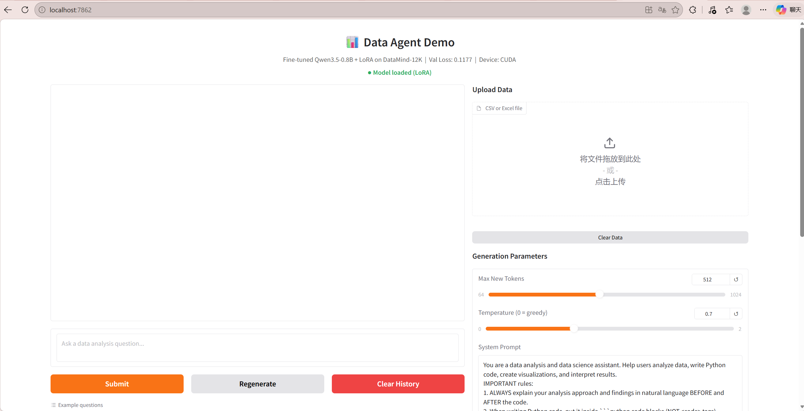
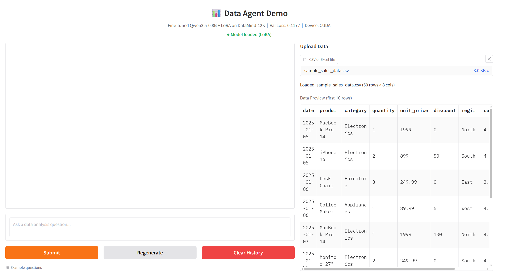
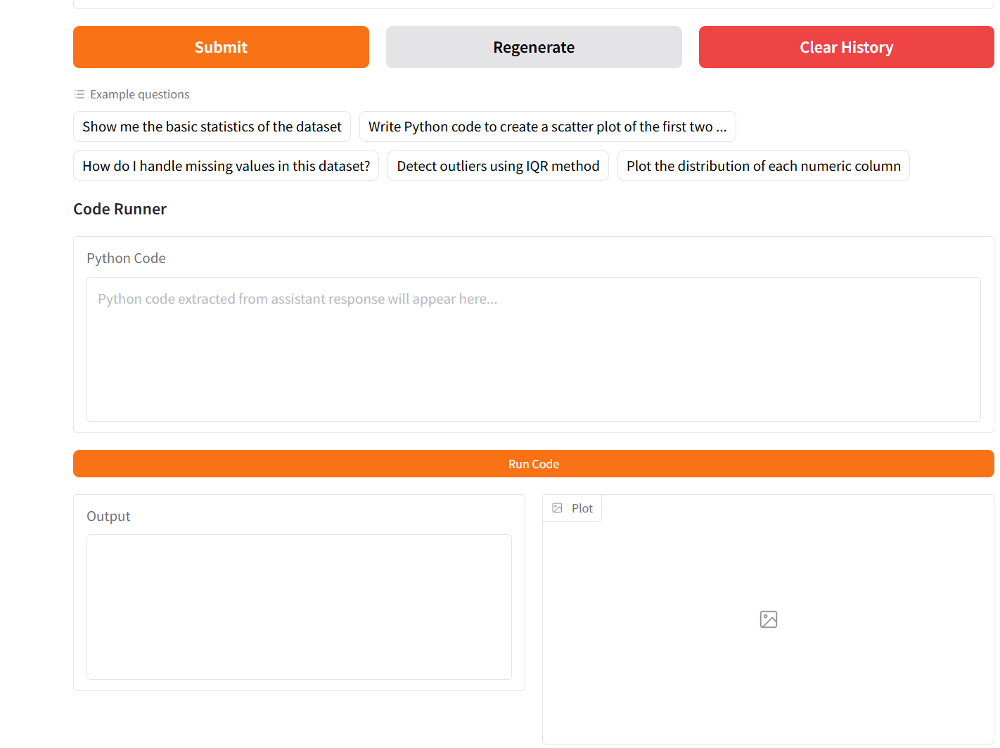
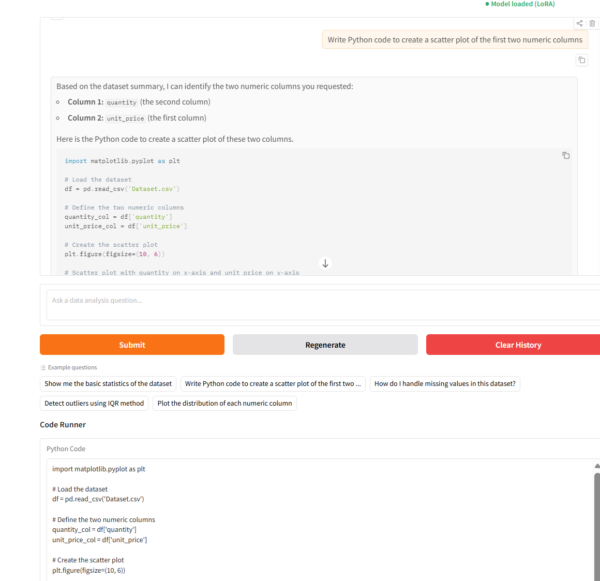
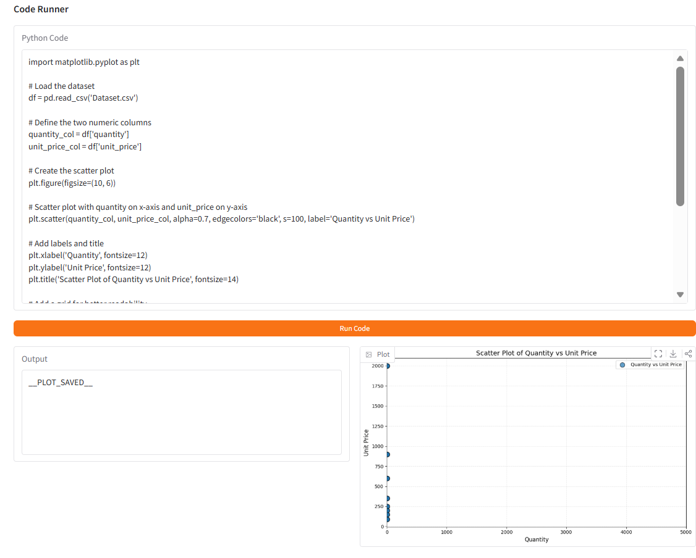
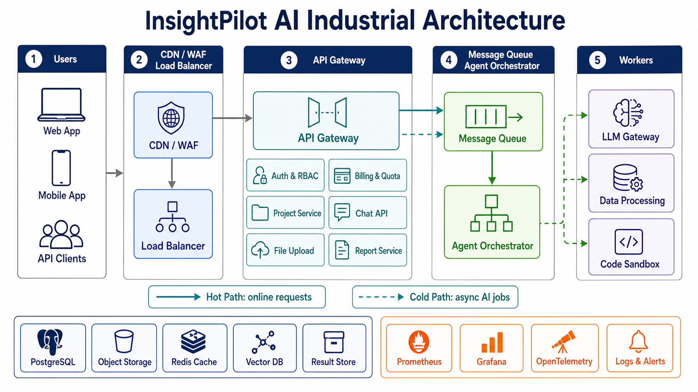

# Project 2 报告：Data Agent System 与 LLM Startup Business Plan

<div class="student-info">张岩&nbsp;&nbsp;12313327</div>

## 摘要

本项目包含两个部分。第一部分是设计并实现一个面向数据分析任务的 generative Data Agent system。系统基于 DataMind-12K 数据集进行数据选择与处理，从中筛选出 2000 条训练样本和 500 条验证样本，并使用 Qwen3.5-0.8B 作为基础模型进行 LoRA 微调。最终部署了一个 Gradio Web Demo，支持 CSV/Excel 文件上传、自然语言数据分析问答、Python 代码生成、代码一键执行和图表展示。

第二部分是围绕 LLM application 设计一个可盈利的 indie startup。我提出的创业项目为 **InsightPilot AI**，一个面向中小企业的 AI data analysis agent SaaS。报告中包含创业想法 brainstorming、商业计划、竞品分析、融资计划，以及支持 100,000 级并发的工业级系统架构设计。

在整个项目中，我使用 **OpenAI ChatGPT / Codex based on GPT-5** 作为辅助工具，用于代码调试、报告结构设计、创业计划 brainstorming、系统架构设计和文本润色。最终内容、代码实现和事实检查由我负责。

---

## 目录

1. Q1 Data Agent System  
   1.1 任务目标  
   1.2 数据选择方法  
   1.3 DataMind-12K 数据处理  
   1.4 Qwen3.5-0.8B + LoRA 微调  
   1.5 Web Demo 部署  
   1.6 调试问题与解决方案  
   1.7 Q1 小结  
2. Q2 Startup Business Plan  
   2.1 创业想法 Brainstorming  
   2.2 InsightPilot AI 商业计划  
   2.3 竞品调研与比较  
   2.4 融资路演计划  
   2.5 100,000 级并发系统架构设计  
   2.6 Q2 小结  
3. LLM 使用声明与 Prompts 记录  
4. 参考文献  
5. 附录：截图清单与项目结构  

---

# 1. Q1 Data Agent System

## 1.1 任务目标

Q1 的目标是设计并构建一个 generative Data Agent system，使没有编程或数据科学专业知识的用户，也可以通过自然语言 prompt 让 LLM 自动生成端到端数据分析流程、数学抽象、预测模型和可解释结果。项目指定的训练数据集为 **DataMind-12K**，基础模型为 **Qwen3.5-0.8B**。

本项目围绕以下四个任务展开：

1. 阅读 *A Survey on Data Selection for Language Models*，选择并说明适合数据科学和数学建模领域的数据选择方法。
2. 编写 Python 代码处理 `datamind_12k.json`，从中选择 2000 条训练样本和 500 条验证样本，而不是随机采样。
3. 使用 Ray Train 对 Qwen3.5-0.8B 进行 LoRA fine-tuning，并保存 checkpoint。
4. 在本地 laptop 上部署 agent model，并准备 Web Demo。

项目最终实现了从 **Data Selection → Model Fine-tuning → Web Application Deployment** 的完整流程。

---

## 1.2 数据选择方法

在阅读 Survey 后，我认为数据科学和数学建模领域最适合的数据选择方法主要包括三类：IFD、InstructMining 和 K-Center Greedy。它们分别从指令跟随难度、多指标质量评估和多样性覆盖角度筛选训练数据。

### 1.2.1 IFD：Instruction Following Difficulty

IFD 的核心思想是衡量一条 instruction 对生成目标 answer 的贡献。如果模型在给定问题 Q 后生成答案 A 的概率明显高于无条件生成答案 A 的概率，说明这条 instruction 对 answer 有明确指导作用，训练价值较高。

其基本形式为：

```text
IFD(Q, A) = sθ(A|Q) / sθ(A)
```

其中：

- `sθ(A|Q)` 表示给定 instruction 时 answer 的生成分数。
- `sθ(A)` 表示不考虑 instruction 时 answer 本身的生成分数。

对于数据分析 agent，用户问题通常要求模型理解数据背景、选择分析方法、编写 Python/pandas 代码、执行分析并解释结果。因此，高质量轨迹应该具有较强的 instruction-answer 依赖关系。

在代码实现中，我没有只依赖真实模型 IFD 计算，而是设计了一个 **IFD-inspired heuristic quality score**，用于快速筛掉低质量轨迹。评分特征包括：

- 多轮推理深度。
- 是否包含代码块。
- 是否有 `Thought` / `Observation` 等推理结构。
- 用户指令复杂度。
- assistant 回答丰富度。
- pandas、numpy、matplotlib、sklearn 等数据科学工具使用情况。
- 统计分析和机器学习相关词汇。
- 是否包含错误处理过程。
- 数据集自带 level difficulty metadata。

对应实现位于 `data_processing.py` 中的 `compute_quality_score()` 和 `quality_filter()`。

### 1.2.2 InstructMining：多指标质量评估

InstructMining 将 instruction tuning 数据选择看作一种数据挖掘问题。它使用多个指标预测样本对模型微调效果的贡献，例如输入长度、输出长度、困惑度、奖励分数、词汇多样性、embedding 近邻距离、自然度、连贯性和可理解性等。

数据分析任务通常不是单一文本生成任务，而是混合了自然语言推理、代码生成、代码执行、图表解释和错误修复。因此，多指标方法比单一长度或单一打分更适合。

本项目中额外实现了一个基于 DeepSeek API 的评分脚本 `deepseek_scoring.py`。它使用外部 LLM 对轨迹进行多维度评分：

- `reasoning_depth`
- `code_correctness`
- `instruction_clarity`
- `answer_completeness`
- `educational_value`

该脚本可以作为 InstructMining 思路的扩展，用于对候选轨迹做 reward-based reranking。

### 1.2.3 K-Center Greedy：多样性驱动核心集选择

K-Center Greedy 的目标是在 embedding 空间中选择一组代表性样本，使未选样本到最近已选样本的最大距离尽可能小。直观理解就是每一步都选择“离当前已选集合最远”的样本，从而保证覆盖不同任务类型。

DataMind-12K 覆盖大量数据科学任务，包括：

- 数据清洗。
- 描述性统计。
- 数据可视化。
- 机器学习建模。
- 数学建模。
- 数据转换和 ETL。
- 分析报告生成。

如果随机采样，常见任务可能被过度选择，而稀有但重要的任务会被忽略。因此，本项目在质量筛选后使用 K-Center Greedy 做多样性选择。

对应实现位于 `data_processing.py`：

- `build_tf_embeddings()`：构建基于 term frequency 的轻量文本向量。
- `k_center_greedy()`：执行 K-Center Greedy 选择。
- `diversity_select()`：先选择 validation set，再从剩余样本中选择 training set。

---

## 1.3 DataMind-12K 数据处理

### 1.3.1 数据处理流程

数据处理脚本为 `data_processing.py`。整体流程如下：

1. 加载 DataMind-12K 原始 JSON 数据。
2. 使用 IFD-inspired heuristic quality score 为每条轨迹打分。
3. 保留 top 75% 的候选样本，过滤低质量样本。
4. 如果存在 IFD 或 DeepSeek API 评分文件，则可进行二次 reranking。
5. 使用 K-Center Greedy 选择 500 条 validation samples。
6. 从剩余样本中选择 2000 条 training samples。
7. 将数据转换为 Qwen ChatML 格式。
8. 生成 selection report。

核心配置如下：

| 参数 | 数值 |
|---|---:|
| 训练集大小 | 2000 |
| 验证集大小 | 500 |
| 质量筛选比例 | top 75% |
| 多样性方法 | K-Center Greedy |
| 输出格式 | ChatML JSONL |
| 训练文件 | `data/train_data.jsonl` |
| 验证文件 | `data/val_data.jsonl` |

### 1.3.2 数据选择结果

最终生成的数据文件如下：

- `data/train_data.jsonl`：2000 条训练样本。
- `data/val_data.jsonl`：500 条验证样本。
- `data/selection_report.txt`：数据选择统计报告。

选择结果统计如下：

| 数据集 | 样本数 | 平均词数 | 词数范围 | 平均轮数 | 轮数范围 |
|---|---:|---:|---|---:|---|
| Training Set | 2000 | 1771 | 982 - 4062 | 10.0 | 5 - 23 |
| Validation Set | 500 | 1858 | 1024 - 4172 | 10.5 | 5 - 21 |

难度分布如下：

| 数据集 | Level 分布 |
|---|---|
| Training Set | `N/A`: 976, `easy`: 538, `Highly Complex`: 370, `Moderate`: 67, `Simple`: 41, `Complex`: 8 |
| Validation Set | `N/A`: 226, `Highly Complex`: 131, `easy`: 95, `Simple`: 20, `Moderate`: 20, `Complex`: 8 |

从统计可以看出，训练集和验证集都保留了较长、多轮的数据分析轨迹，平均每条样本约 10 轮对话，说明筛选结果更偏向完整的数据分析过程，而不是简单的一问一答。

### 1.3.3 Optional Scoring

项目还提供了两个可选评分脚本：

1. `deepseek_scoring.py`  
   使用 DeepSeek API 对轨迹进行多维度质量评分。为了控制 API 成本，默认 `MAX_SAMPLES = 500`，并支持断点续跑。

2. `ifd_scoring.py`  
   使用本地 Qwen 模型和 LoRA adapter 计算 model-based IFD score。默认 `MAX_SAMPLE_SIZE = 500`，最大模型上下文长度为 2048。

这两个脚本没有替代主流程，而是作为进一步 reranking 和质量分析的扩展。

---

## 1.4 Qwen3.5-0.8B + LoRA 微调

### 1.4.1 模型与训练设置

本项目使用 **Qwen3.5-0.8B** 作为基础模型，模型文件保存在：

```text
Spark_Project2/qwen_model_local/
```

训练脚本为 `train.py`，使用 Ray Train 组织训练流程，并使用 PEFT LoRA 进行参数高效微调。

主要训练配置如下：

| 配置项 | 数值 |
|---|---|
| Base Model | Qwen3.5-0.8B |
| Fine-tuning Method | LoRA |
| LoRA rank `r` | 16 |
| LoRA alpha | 32 |
| LoRA dropout | 0.05 |
| Target Modules | `q_proj`, `k_proj`, `v_proj`, `o_proj`, `gate_proj`, `up_proj`, `down_proj` |
| Epochs | 3 |
| Batch Size | 1 |
| Learning Rate | 5e-5 |
| Max Length | 1536 |
| Gradient Accumulation Steps | 8 |
| Mixed Precision | CUDA 使用 bfloat16，否则 fp32 |
| Gradient Checkpointing | Enabled |

LoRA adapter 最终保存在：

```text
output/qwen-datamind-lora-v2/best_model/
```

其中：

- `adapter_config.json`：LoRA 配置。
- `adapter_model.safetensors`：LoRA 权重，大小约 25.6 MB。

### 1.4.2 数据预处理与 Loss Masking

训练脚本中的 `preprocess_dataset()` 使用 Qwen tokenizer 的 `apply_chat_template()` 将多轮消息转换为 ChatML 格式。为了让模型重点学习 assistant 的回答，而不是学习 user/system 内容，代码实现了 assistant-only loss masking：

1. 找到每个 `<|im_start|>assistant` 到 `<|im_end|>` 之间的 assistant content。
2. 只保留 assistant token 的 labels。
3. 其他 token 的 labels 设为 `-100`，不参与 loss 计算。

这种处理方式更适合 instruction tuning，因为模型训练目标是根据用户指令生成 assistant response。

### 1.4.3 Ray Train 训练流程

训练脚本使用 `TorchTrainer` 启动训练。训练过程中：

1. 加载 tokenizer 和 base model。
2. 应用 LoRA adapter。
3. 启用 gradient checkpointing 以降低显存占用。
4. 加载训练集和验证集 JSONL。
5. 对数据进行 tokenization。
6. 使用 AdamW optimizer 和 linear warmup scheduler。
7. 每个 epoch 后计算 validation loss。
8. 通过 `train.report()` 向 Ray Train 汇报 `train_loss`、`val_loss`、`learning_rate` 和 `global_step`。
9. 以 `val_loss` 作为 checkpoint 选择指标。

### 1.4.4 训练结果

根据 Web Demo 中显示和项目记录，最终 best model 的 validation loss 为：

```text
Val Loss: 0.1177
```

LoRA adapter 文件已经成功生成，说明微调流程已完成。该 adapter 在部署阶段被加载到基础模型上，用于数据分析 assistant 的推理。

---

## 1.5 Web Demo 部署

### 1.5.1 Demo 功能概述

Web Demo 实现在 `app.py` 中，使用 Gradio 构建。系统支持：

1. 加载 Qwen3.5-0.8B base model。
2. 加载 LoRA adapter。
3. 上传 CSV/Excel 文件。
4. 预览前 10 行数据。
5. 自动生成 dataset summary 并注入 prompt。
6. 流式输出模型回答。
7. 提取回答中的 Python code block。
8. 一键运行代码。
9. 显示 stdout/stderr 和 matplotlib 图表。

启动方式：

```bash
cd E:\hadoop_project2\Spark_Project2\Hadoop_Project2
python app.py
```

浏览器打开：

```text
http://localhost:7862
```



### 1.5.2 文件上传与数据上下文注入

`parse_file()` 支持 CSV、XLSX 和 XLS 文件。上传后，系统会：

1. 使用 pandas 读取文件。
2. 展示前 10 行 preview。
3. 调用 `build_data_context()` 生成数据摘要。
4. 将数据摘要追加到 system prompt 中。

数据摘要包含：

- 数据行列数。
- 列名。
- 每列 dtype。
- 缺失值统计。
- 前 5 行样例。

这样模型在回答用户问题时可以知道当前数据集的结构，不需要用户手动描述字段。



### 1.5.3 流式对话与上下文管理

`chat_stream()` 使用 Qwen tokenizer 的 chat template 构造输入，并使用 `TextIteratorStreamer` 实现流式输出。为了避免超过上下文窗口，代码设置：

```text
MAX_CONTEXT_TOKENS = 2048
MAX_NEW_TOKENS = 512
TEMPERATURE = 0.7
TOP_P = 0.9
```

当历史对话过长时，系统会删除较早的 history，保留最新上下文和当前问题。



### 1.5.4 Code Runner

Code Runner 是本项目 Web Demo 的关键功能。它解决了普通 LLM 回答不能直接执行的问题。

实现细节包括：

1. `extract_code_blocks()` 支持三种代码格式：
   - Markdown Python code block，即以三个反引号加 `python` 开头的代码块。
   - 无语言标记 code block，即普通三个反引号代码块。
   - DataMind-12K 中常见的 `<code>...</code>` XML 标签。
2. 使用 `textwrap.dedent()` 修复缩进。
3. 使用临时 CSV 文件将上传数据传入 subprocess。
4. 在执行环境中预先加载 `df` 变量。
5. 自动替换模型生成的 `df = pd.read_csv(...)`，避免路径错误。
6. 自动保存 matplotlib figure。
7. 将图像写入临时 PNG 文件并返回给 Gradio `gr.Image`。





---

## 1.6 调试问题与解决方案

项目从 Linux 环境迁移到 Windows 11 laptop 后遇到了一系列工程问题。主要问题和解决方案如下：

| 问题 | 原因 | 解决方案 |
|---|---|---|
| 基础模型缺失 | `qwen_model_local/` 被 `.gitignore` 排除 | 从 HuggingFace 下载 Qwen3.5-0.8B 到本地模型目录 |
| Linux 绝对路径无法使用 | 原代码使用 `/root/Hadoop_Project2/` | 改为基于 `os.path.dirname(os.path.abspath(__file__))` 的相对路径 |
| torch/torchvision 不兼容 | 预装开发版 torch 与 torchvision 版本不匹配 | 重装与 CUDA 12.8 匹配的 PyTorch 版本 |
| transformers 不支持 `qwen3_5` | transformers 版本过旧 | 升级 transformers |
| Code Runner 无法提取代码 | 模型输出 `<code>` 标签而非 Markdown code block | 扩展正则，支持 Markdown 和 XML code tags |
| `pd.read_csv` 路径错误 | 模型生成了不存在的文件路径 | 执行前移除 `df = pd.read_csv(...)`，使用预加载的 `df` |
| 日期列类型错误 | CSV 重新读取后日期变成 string | 使用 `parse_dates=True` |
| Gradio 图片不显示 | `gr.Image` 不接受 base64 字符串 | 将 base64 解码成临时 PNG 文件 |
| 代码缩进异常 | LLM 输出代码缩进不稳定 | 使用 `textwrap.dedent()` |
| 模型只输出代码 | 微调数据风格影响输出 | 优化 System Prompt，要求先解释再给代码 |

这些调试过程说明，Data Agent 不只是模型训练任务，也包含完整的工程适配：路径管理、依赖版本、UI 交互、代码执行安全和模型输出格式对齐。

---

## 1.7 Q1 小结

Q1 最终完成了一个可运行的数据分析 agent prototype：

- 使用 Survey 中的数据选择思想完成了非随机采样。
- 生成了 2000 条训练数据和 500 条验证数据。
- 使用 Ray Train + LoRA 对 Qwen3.5-0.8B 进行了微调。
- 保存了 LoRA adapter checkpoint。
- 实现了支持文件上传、自然语言问答、代码执行和图表展示的 Gradio demo。

该系统初步证明了：经过数据选择和领域微调后，LLM 可以作为数据分析 agent 的核心模块，帮助普通用户完成从数据理解到代码执行和结果解释的工作流。

---

# 2. Q2 Startup Business Plan

## 2.1 创业想法 Brainstorming

Q2 要求设计一个基于 LLM applications 的 startup，并撰写商业计划、竞品分析和路演计划。结合 Q1 中实现的 Data Agent，我 brainstorm 了多个方向：

| 创业想法 | 目标用户 | 核心价值 | 选择情况 |
|---|---|---|---|
| AI data analysis assistant for SMEs | 小企业、营销团队、运营团队 | 上传数据并用自然语言获得分析、图表和报告 | 最终选择 |
| AI business plan writer | 学生、初创 founders | 自动生成商业计划和 pitch deck | 竞争激烈，差异化不足 |
| AI financial modeling copilot | 创业者和财务团队 | 自动构建财务预测和投资模型 | 需要更强金融验证 |
| AI survey/report generator | 研究人员、咨询顾问 | 自动分析问卷并生成报告 | 初始市场较窄 |
| AI no-code ML prediction tool | 销售、营销和运营团队 | 预测 churn、conversion、demand | 技术复杂度高，竞品较强 |

最终选择的创业项目为 **InsightPilot AI**：一个面向中小企业的 AI-powered data analysis agent。

---

## 2.2 InsightPilot AI 商业计划

### 2.2.1 Executive Summary

InsightPilot AI 是一个面向 small and medium-sized businesses 的自然语言数据分析平台。用户可以上传 CSV/Excel 文件或连接 Google Sheets、Shopify、Google Ads、PostgreSQL 等数据源，然后用自然语言提出业务问题。系统自动完成数据清洗建议、统计摘要、可视化图表、Python/SQL code、业务洞察和可导出报告。

其核心价值是让没有专业数据团队的小公司，也可以拥有一个低成本、随时可用、可复现的 AI data analyst。

### 2.2.2 Problem

中小企业普遍面临以下问题：

1. 数据存在于多个系统中，但没有能力快速分析。
2. 传统 BI tools 需要建模、配置和维护。
3. 通用 chatbot 不适合长期项目管理和团队协作。
4. 雇佣 full-time data analyst 成本高。
5. 业务决策需要可解释、可复现的分析过程。

### 2.2.3 Product

InsightPilot AI 的核心功能包括：

- CSV/Excel upload。
- Google Sheets、Shopify、Stripe、HubSpot 等 connectors。
- Natural-language analysis。
- Automatic data cleaning and profiling。
- Charts and reports。
- Transparent code and reproducible workflow。
- Scheduled weekly/monthly reports。

### 2.2.4 Target Market

第一个 beachhead market 是 5-100 人规模的 e-commerce 和 digital marketing teams。这类团队经常需要分析 sales、campaign、customer、inventory 和 ROI 数据，但通常没有完整的数据团队。

典型用户包括：

- E-commerce founder。
- Marketing manager。
- Operations manager。
- Junior analyst。

### 2.2.5 Business Model

InsightPilot AI 采用 SaaS subscription model：

| Plan | Price | Target User | Features |
|---|---:|---|---|
| Free | $0/month | 试用用户和学生 | 有限上传和有限消息 |
| Starter | $19/month | Solo founders | CSV/Excel 分析、图表导出 |
| Team | $49/user/month | 小型团队 | 共享 workspace、scheduled reports、connectors |
| Business | $299/month+ | 成长型 SMEs | 数据库连接、权限管理、audit logs |
| Services | Custom | 需要 onboarding 的企业 | 数据接入、模板配置、培训 |

早期主要依赖 self-serve subscription，后期通过 Business plan 和 implementation services 提高收入。

### 2.2.6 Go-To-Market Strategy

Go-to-market 策略分为三阶段：

1. **MVP Validation**  
   基于 Q1 Data Agent demo 构建 MVP，访谈 20-30 位中小企业用户，验证真实需求。

2. **Community and Content Growth**  
   在 Product Hunt launch，发布 Shopify sales analysis、ad campaign ROI analysis 等案例文章和短视频。

3. **Paid Conversion**  
   当用户需要更大文件、更多分析次数、团队协作、connectors 和 PDF/PPT export 时，引导升级到付费版本。

---

## 2.3 竞品调研与比较

AI data analysis 市场已经存在多个相关产品，但它们的定位并不相同。

| Product | Strengths | Weaknesses | 与 InsightPilot AI 的区别 |
|---|---|---|---|
| ChatGPT Advanced Data Analysis | 灵活、Python/statistical reasoning 强 | 项目持久化、团队 workflow 和 business reporting 较弱 | InsightPilot 更关注 SME workflow 和可复现报告 |
| Julius AI | 非技术用户容易上手，CSV-to-chart 快 | 复杂多步骤分析和人工控制较弱 | InsightPilot 强化 workflow memory、transparent code 和 domain templates |
| Hex | SQL/Python notebook collaboration 强 | 更适合技术团队 | InsightPilot 更面向 business users |
| Deepnote AI | 数据科学 notebook 协作好 | 非技术用户门槛较高 | InsightPilot 不是 notebook-first |
| ThoughtSpot | Enterprise natural-language BI 强 | 需要 enterprise data modeling 和部署 | InsightPilot setup cost 更低 |
| Tableau / Power BI Copilot | Dashboard 成熟，企业生态强 | 配置复杂，不适合快速 ad-hoc 分析 | InsightPilot 作为轻量替代或补充 |
| Rows AI / Capalyze | Spreadsheet-native，对 no-code users 友好 | 容易受 spreadsheet scale 限制 | InsightPilot 增加 agentic analysis 和报告工作流 |
| Akkio | No-code predictive modeling 强 | 更偏预测，不是通用分析平台 | InsightPilot 初期覆盖更广 |

市场空缺在于：

- 通用 AI chat 灵活但缺少团队化工作流。
- 企业 BI 强大但成本和部署门槛高。
- Spreadsheet AI 易用但复杂分析能力有限。

InsightPilot AI 的定位是填补这一空缺，为中小企业提供低门槛、可解释、可复现的数据分析 agent。

---

## 2.4 融资路演计划

在 roadshow presentation 中，InsightPilot AI 可以以以下逻辑展开：

1. Problem：中小企业有数据但没有分析能力。
2. Solution：AI data analyst in a box。
3. Product Demo：上传数据、自然语言提问、生成代码、运行图表、导出报告。
4. Market：SME、e-commerce、digital marketing teams。
5. Competitors：与 ChatGPT、Julius AI、BI tools 和 spreadsheet AI 对比。
6. Business Model：SaaS subscription + services。
7. Go-To-Market：Product Hunt、内容营销、模板获客。
8. Technology：LLM + sandbox execution + report generation。
9. Traction Plan：MVP、beta users、paying users、MRR。
10. Funding Ask：融资 $500,000，支持 18 个月 runway。

融资计划：

| 项目 | 说明 |
|---|---|
| Seed Funding Ask | $500,000 |
| Runway | 18 个月 |
| 45% | Product development and engineering |
| 25% | LLM/API/cloud infrastructure |
| 20% | Sales, marketing and customer acquisition |
| 10% | Legal, security and operations |

预期成果：

- 完成 production-ready SaaS product。
- 建设 5-8 个主要 data connectors。
- 获得 1,000+ paying users 或 100+ team customers。
- 形成清晰的 retention 和 revenue metrics。

---

## 2.5 100,000 级并发系统架构设计

### 2.5.1 架构目标

InsightPilot AI 的工业级系统需要支持 100,000-level concurrency。这里的并发不是指 100,000 个用户同时进行 LLM 推理，而是指平台可同时承载约 100,000 在线用户，其中一部分浏览 dashboard/report，一部分上传数据或查看历史结果，一部分发起 AI analysis。

由于 LLM inference、code execution 和 report generation 成本较高，系统采用同步 + 异步混合架构：

- 轻量请求走 online API。
- 重型分析任务进入 message queue。
- worker pool 异步处理 LLM、数据处理和代码执行任务。

### 2.5.2 高层架构图



### 2.5.3 核心模块

| 模块 | 职责 |
|---|---|
| CDN + WAF | 缓存静态资源，防护恶意请求 |
| Load Balancer | 将请求分发到不同服务实例 |
| API Gateway | 统一鉴权、限流、路由、日志和 quota check |
| Auth & RBAC Service | 用户登录、组织、权限管理 |
| Billing & Quota Service | 订阅计划、token usage、文件大小和调用次数限制 |
| File Upload Service | 文件上传、pre-signed URL、metadata 记录 |
| Data Processing Workers | schema detection、profiling、统计、sample extraction |
| LLM Gateway | 统一封装 OpenAI、DeepSeek、Qwen 和 fallback model |
| Agent Orchestrator | 拆解任务、调用模型、调用工具、整合结果 |
| Code Execution Sandbox | 安全执行 LLM 生成的 Python/SQL code |
| Report Service | 生成 PDF/PPT/Shareable report |
| PostgreSQL | 用户、项目、权限、metadata |
| Object Storage | 原始文件、图表、报告等大文件 |
| Redis | Session、hot metadata、job status、rate limit |
| Vector Database | RAG memory、semantic cache |
| Monitoring Stack | 指标、日志、链路追踪和告警 |

### 2.5.4 高并发设计

系统采用以下策略支持 100,000 级并发：

1. **Hot Path / Cold Path 分离**  
   登录、项目列表、历史报告读取等轻量请求走 Hot Path；LLM reasoning、代码执行、大文件 profiling 和报告生成走 Cold Path。

2. **Horizontal Scaling**  
   所有 stateless services 部署在 Kubernetes 上，根据 QPS、CPU、queue length 和 token throughput 自动扩容。

3. **Message Queue**  
   使用 Kafka 或 RabbitMQ 处理异步任务，包括 dataset profiling、analysis planning、code execution、report generation 和 scheduled jobs。

4. **Caching Strategy**  
   使用 CDN cache、Redis cache、semantic cache、result cache 和 model cache 降低重复计算。

5. **Database Scaling**  
   PostgreSQL 采用 primary + read replicas，后续按 `organization_id` 或 `workspace_id` sharding。Object Storage 用于承载大文件。

6. **Backpressure and Quota**  
   当 queue length 过高时，对 Free plan 降低优先级，对 Team/Business plan 保留优先队列，并对超出 quota 的请求提示升级。

### 2.5.5 安全与可靠性

由于系统会执行 LLM 生成的代码，安全设计非常重要：

- 每个代码执行任务运行在隔离 container 或 microVM。
- 限制 CPU、memory、runtime 和 network access。
- 默认禁止公网访问。
- 只挂载当前 dataset 的临时只读副本。
- 对危险代码进行 static scan。
- 保存 stdout、stderr、generated files 和 charts。

可靠性设计包括：

- LLM API timeout 时 retry + circuit breaker + fallback model。
- worker crash 后 queue message 重新投递。
- PostgreSQL primary failure 后自动 failover。
- 新模型使用 shadow testing 和 canary deployment。
- 系统支持 rollback。

### 2.5.6 Monitoring and Operation Module

监控指标包括：

- API QPS、p95/p99 latency、error rate。
- CPU、memory、GPU utilization。
- Redis hit ratio。
- Queue length and consumer lag。
- LLM tokens per request、cost per request、timeout rate、fallback rate。
- Code execution success rate。
- Dataset upload success rate。
- Profiling failure rate。

工具栈：

- Prometheus：指标采集。
- Grafana：dashboard。
- ELK / OpenSearch：日志检索。
- OpenTelemetry：distributed tracing。
- Alertmanager / PagerDuty：告警。
- Sentry：异常追踪。

---

## 2.6 Q2 小结

Q2 以 Q1 的 Data Agent 技术原型为基础，延伸出一个可商业化的 LLM startup：InsightPilot AI。该产品面向中小企业的数据分析需求，采用 SaaS subscription model，并通过自然语言分析、代码执行、图表生成和报告导出形成差异化。

在系统架构层面，InsightPilot AI 使用 cloud-native、event-driven 和 AI-native 的组合设计。其核心思想是：用 horizontal scaling 支撑普通 Web 并发，用 queue 和 worker pool 承接重型 AI 任务，用 cache 和 quota 控制成本，用 sandbox 和 RBAC 保护企业数据安全，用 monitoring 和 feedback loop 持续优化服务质量。

---

# 3. LLM 使用声明与 Prompts 记录

## 3.1 LLM 使用声明

本项目中，我使用 **OpenAI ChatGPT / Codex based on GPT-5** 作为辅助工具，主要用于：

1. 帮助理解 Project 2 的任务要求。
2. 辅助阅读和整理数据选择相关方法。
3. 协助设计 Data Agent 的数据处理、训练和部署流程。
4. 协助排查代码路径、依赖、Gradio UI、代码执行器等工程问题。
5. 协助 Q2 创业方向 brainstorming。
6. 协助撰写 InsightPilot AI 的商业计划。
7. 协助设计支持 100,000 级并发的系统架构。
8. 协助整理中文报告和 PPT 结构。

所有由 LLM 生成或建议的内容都经过我检查、修改和整合。我对最终提交的代码、报告内容和事实正确性负责。

## 3.2 Prompts 记录

以下为我与 LLM 交互时使用的代表性 prompts。为便于报告呈现，部分对话经过整理，但保留了真实任务意图。

### Prompt 1：项目理解

**Student:**  
阅读 Project 2 的 PDF，帮我理解任务要求，并判断我当前代码已经完成了哪些部分，还缺哪些提交材料。

**LLM:**  
项目包含 Q1 Data Agent System、Q2 Startup Business Plan 和 Presentation。你当前已经完成 Q1 的数据处理、训练脚本和 Gradio demo，但还需要整理报告、PPT、Q2 商业计划和系统架构设计。

### Prompt 2：数据选择方法

**Student:**  
我需要阅读 A Survey on Data Selection for Language Models，并选择三个适合数据科学和数学建模领域的数据选择方法。请帮我比较 IFD、InstructMining 和 K-Center Greedy，并说明它们为什么适合 DataMind-12K。

**LLM:**  
IFD 适合衡量 instruction 与 answer 的依赖关系；InstructMining 适合从多个维度评价轨迹质量；K-Center Greedy 适合保证数据科学任务类型的多样性。三者组合可以形成质量筛选加多样性选择的 pipeline。

### Prompt 3：数据处理代码

**Student:**  
请帮我设计 DataMind-12K 的数据处理流程：不能随机采样，要先做质量筛选，再做多样性选择，最终输出 2000 条训练样本和 500 条验证样本，格式适配 Qwen training。

**LLM:**  
可以先设计 IFD-inspired heuristic score，包括多轮推理、代码使用、工具使用、回答长度、分析词汇和难度标签等特征；然后保留 top 75%；再用 K-Center Greedy 选择 validation 和 training samples；最后输出 ChatML JSONL。

### Prompt 4：训练脚本

**Student:**  
请帮我检查 Qwen3.5-0.8B 的 LoRA 微调脚本，确保它使用 Ray Train、assistant-only loss masking、gradient checkpointing，并能保存 checkpoint。

**LLM:**  
训练脚本应加载 tokenizer 和 base model，使用 PEFT LoRA 配置 target modules，对 ChatML 数据做 assistant-only label masking，用 Ray TorchTrainer 管理训练，并以 validation loss 作为 checkpoint selection 指标。

### Prompt 5：Web Demo 调试

**Student:**  
我的 Gradio app 可以生成代码，但 Code Runner 提取不到代码；模型有时输出 `<code>` 标签，有时输出 markdown code block。请帮我修改提取逻辑。

**LLM:**  
可以让 `extract_code_blocks()` 同时支持 Markdown Python code block、普通 Markdown code block 和 `<code>...</code>` 三种格式，并使用 `textwrap.dedent()` 清理缩进。

### Prompt 6：Q2 创业方向

**Student:**  
我需要完成一个 LLM startup business plan。请 brainstorm 5 个与 LLM application 相关、适合 indie team 的创业想法，并结合我 Q1 的 Data Agent 项目选择最自然的方向。

**LLM:**  
可以考虑 AI data analysis assistant、AI business plan writer、AI financial modeling copilot、AI survey/report generator 和 AI no-code ML prediction tool。最适合的是 AI data analysis assistant，因为它与 Q1 技术原型直接相关。

### Prompt 7：竞品分析

**Student:**  
请帮我比较 InsightPilot AI 与 ChatGPT Advanced Data Analysis、Julius AI、Hex、Deepnote、ThoughtSpot、Tableau/Power BI、Rows AI、Capalyze 和 Akkio。重点比较优势、弱点和差异化。

**LLM:**  
这些产品可以分为 general AI chat、no-code AI analysis、technical notebooks、enterprise BI、spreadsheet AI 和 no-code prediction。InsightPilot AI 应重点定位 SME workflow、transparent code、reproducible reports 和 low setup cost。

### Prompt 8：系统架构设计

**Student:**  
请为 InsightPilot AI 设计支持 100,000 级并发的工业级系统架构，需要包含 LLM engine、data processing、database、高并发模块、monitoring and operation module，并给出系统架构图。

**LLM:**  
架构可以包括 CDN/WAF、Load Balancer、API Gateway、stateless microservices、Object Storage、PostgreSQL、Redis、Vector Database、Message Queue、Agent Orchestrator、LLM Gateway、Data Processing Workers、Code Execution Sandbox 和 Monitoring Stack。

---

# 4. 参考文献

1. Albalak, A., Elazar, Y., Xie, S. M., Longpre, S., Lambert, N., Wang, X., et al. (2024). *A Survey on Data Selection for Language Models*. TMLR. arXiv:2402.16827.
2. Li, M., et al. (2023). *From Quantity to Quality: Boosting LLM Performance with Self-Guided Data Selection for Instruction Tuning*. arXiv:2308.12032.
3. Cao, Y., et al. (2023). *Instruction Mining: When Data Mining Meets Large Language Model Finetuning*. arXiv:2307.06290.
4. Sener, O., & Savarese, S. (2018). *Active Learning for Convolutional Neural Networks: A Core-Set Approach*. ICLR.
5. Qiao, S., et al. (2025). *Scaling Generalist Data-Analytic Agents*. arXiv:2509.25084.
6. DataMind-12K repository and dataset documentation.
7. Qwen model documentation and HuggingFace model files.
8. Ray Train documentation.
9. PEFT / LoRA documentation.
10. Gradio documentation.
11. Cambridge Judge Business School. *How to Write a Business Plan*. https://www.jbs.cam.ac.uk/wp-content/uploads/2020/08/how-to-write-a-business-plan.pdf
12. Side Project Guide. https://sideproject.guide/
13. Investopedia. *How to Start a Business: Essential Steps and Key Considerations*. https://www.investopedia.com/how-to-start-a-business-7970202
14. Product Hunt, Capalyze product page. https://www.producthunt.com/products/capalyze
15. Julius AI. *The 10 Best Julius AI Alternatives in 2026*. https://julius.ai/articles/julius-ai-alternatives
16. OpenAIToolsHub. *AI Data Analysis Tools Compared*. https://www.openaitoolshub.org/en/blog/ai-data-analysis-tools
17. System Design Handbook. *AI System Design: A Complete Guide*. https://www.systemdesignhandbook.com/guides/ai-system-design/
18. Donne Martin. *System Design Primer*. https://github.com/donnemartin/system-design-primer
19. ByteByteGo. *System Design 101*. https://github.com/ByteByteGoHq/system-design-101

---

# 5. 附录：截图清单与项目结构

## 5.1 已插入截图清单

| 编号 | 内容 | 建议文件名 |
|---|---|---|
| 图 1 | Gradio 首页和模型加载成功状态 | `picture/1.png` |
| 图 2 | 上传 `sample_sales_data.csv` 后的数据预览 | `picture/2.png` |
| 图 3 | 自然语言问答与统计分析结果 | `picture/3.png` |
| 图 4 | 模型生成 Python 代码，Code Runner 成功提取代码 | `picture/5.png` |
| 图 5 | 运行代码后展示 stdout 和图表 | `picture/6.png` |
| 图 6 | Q2 工业级系统架构图 | `picture/q2_architecture_diagram_imagegen.png` |

## 5.2 项目文件结构

```text
Spark_Project2/
├── qwen_model_local/                  # Qwen3.5-0.8B 基础模型
└── Hadoop_Project2/
    ├── app.py                         # Gradio Web UI
    ├── data_processing.py             # 数据质量评分 + 多样性筛选
    ├── ifd_scoring.py                 # Model-based IFD 评分
    ├── deepseek_scoring.py            # DeepSeek API 轨迹评分
    ├── train.py                       # Ray Train LoRA 微调脚本
    ├── README.md                      # 项目说明
    ├── deployment_log.md              # 部署和调试记录
    ├── Q1_1_Data_Selection_Methods.md # Q1 数据选择方法说明
    ├── Q2_1_Business_Plan.md          # Q2(1) 商业计划
    ├── Q2_2_System_Architecture.md    # Q2(2) 系统架构设计
    ├── REPORT_ZH_DRAFT.md             # 中文报告初稿
    ├── sample_sales_data.csv          # Demo 测试数据
    ├── data/
    │   ├── train_data.jsonl           # 2000 条训练样本
    │   ├── val_data.jsonl             # 500 条验证样本
    │   └── selection_report.txt       # 数据选择统计
    └── output/
        └── qwen-datamind-lora-v2/
            └── best_model/
                ├── adapter_config.json
                └── adapter_model.safetensors
```

## 5.3 运行命令

```bash
# 数据处理
python data_processing.py

# 可选：DeepSeek API 评分
python deepseek_scoring.py

# 可选：IFD 模型评分
python ifd_scoring.py

# LoRA 微调
python train.py

# 启动 Web Demo
python app.py
```

---

## 结论

本项目完成了从数据选择、模型微调到本地 Web Demo 部署的 Data Agent 原型，并进一步围绕该原型设计了一个可商业化的 LLM startup：InsightPilot AI。Q1 的工程实现展示了 LLM 在数据分析任务中的实际可用性，Q2 的商业计划和系统架构设计则说明该技术如何进一步扩展为面向中小企业的工业级 SaaS 产品。
